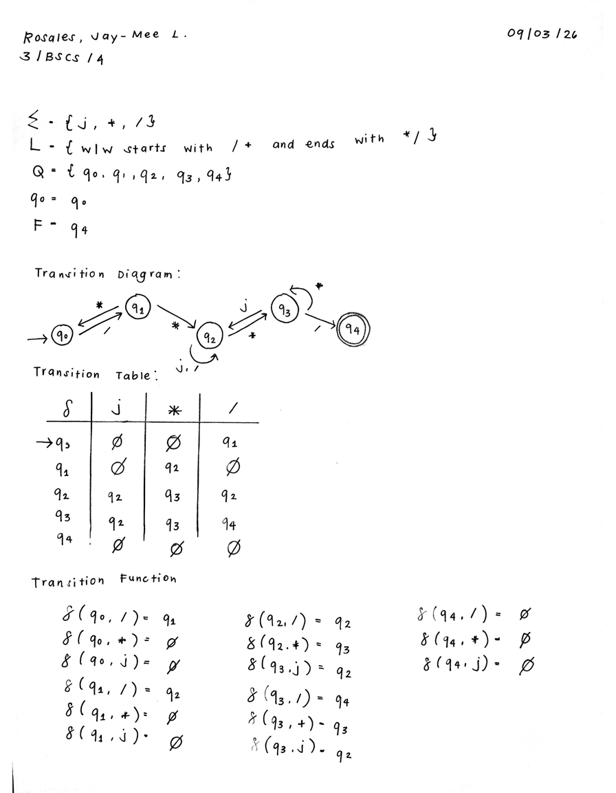

# CS13_NFA

A formal finite state machine implementation for recognizing C-style comments (`/* ... */`) over the alphabet $\\Sigma = \\{j, *, /\\}$, where symbol `j` serves as a placeholder for any character other than `*` or `/`.

---

- **States ($Q$):** $\\{ q_0, q_1, q_2, q_3, q_4 \\}$
- **Alphabet ($\\Sigma$):** $\\{ j, *, / \\}$
- **Start State ($q_0$):** $q_0$
- **Accept / Final State ($F$):** $\\{ q_4 \\}$

---

## Transition Function 

- **State $q_0$ (Start state - looking for comment start `/`)**
  - $\\delta(q_0, /) = \\{q_1\\}$
  - $\\delta(q_0, *) = \\emptyset$
  - $\\delta(q_0, j) = \\emptyset$

- **State $q_1$ (Received initial `/` - looking for starting `*`)**
  - $\\delta(q_1, *) = \\{q_2\\}$
  - $\\delta(q_1, /) = \\emptyset$
  - $\\delta(q_1, j) = \\emptyset$

- **State $q_2$ (Inside comment body)**
  - $\\delta(q_2, j) = \\{q_2\\}$
  - $\\delta(q_2, /) = \\{q_2\\}$
  - $\\delta(q_2, *) = \\{q_3\\}$

- **State $q_3$ (Seen potential closing `*`)**
  - $\\delta(q_3, /) = \\{q_4\\}$
  - $\\delta(q_3, *) = \\{q_3\\}$
  - $\\delta(q_3, j) = \\{q_2\\}$

- **State $q_4$ (Accept state - comment cleanly closed)**
  - $\\delta(q_4, j) = \\emptyset$
  - $\\delta(q_4, *) = \\emptyset$
  - $\\delta(q_4, /) = \\emptyset$

---

## Transition Table

| Present State | Input `j` | Input `*` | Input `/` |
| :---: | :---: | :---: | :---: |
| **$q_0$ (Start)** | $\\emptyset$ | $\\emptyset$ | $\\{q_1\\}$ |
| **$q_1$** | $\\emptyset$ | $\\{q_2\\}$ | $\\emptyset$ |
| **$q_2$** | $\\{q_2\\}$ | $\\{q_3\\}$ | $\\{q_2\\}$ |
| **$q_3$** | $\\{q_2\\}$ | $\\{q_3\\}$ | $\\{q_4\\}$ |
| **$q_4$ (Accept)** | $\\emptyset$ | $\\emptyset$ | $\\emptyset$ |

---

## Full Transition Details

